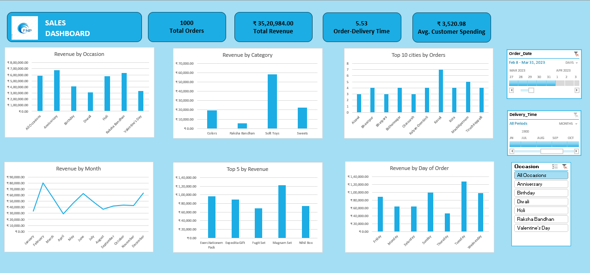

# 📊 Sales Analytics Dashboard (Excel Project)

## 🔎 Problem Statement
Businesses often struggle to convert raw sales data into actionable insights. 
This project aims to design an interactive Excel dashboard that provides 
real-time visibility into revenue, customer behavior, and sales trends.

## 🎯 Objective
To develop a dynamic dashboard that:
- Tracks key performance indicators (KPIs)
- Analyzes revenue by occasion and category
- Identifies top-performing cities and products
- Visualizes monthly and daily trends

## 🛠 Tools Used
- Microsoft Excel
- Pivot Tables
- Pivot Charts
- Slicers
- Timeline Filters
- Data Cleaning
- Aggregation Functions (SUM, COUNT, AVERAGE)

## 📈 Key Metrics
- Total Orders: 1000
- Total Revenue: ₹35,20,984
- Average Delivery Time: 5.53 Days
- Average Customer Spending: ₹3,520.98

## 📊 Dashboard Features
- Revenue by Occasion
- Revenue by Category
- Top 10 Cities by Orders
- Revenue by Month
- Top 5 Products by Revenue
- Revenue by Day of Order
- Interactive Slicers for filtering

## 💡 Business Impact
This dashboard supports data-driven decision-making by enabling 
quick performance evaluation and trend analysis.

## 📷 Dashboard Preview

